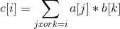

# Fast Transfrom

## FFT

* <del> 人尽皆知傅立叶 </del>

* 如对a、b数组求卷积， 结果存在a中

```cpp
    void solve(int a[], int lena, int b[], int lenb) {
        int len = FFT::trans(lena + lenb - 1);
        Complex a1[len], b1[len];
        for (int i = 0; i < lena; i++) a1[i].r = a[i], a1[i].i = 0;
        for (int i = lena; i < len; i++) a1[i].r = a1[i].i = 0;
        for (int i = 0; i < lenb; i++) b1[i].r = b[i], b1[i].i = 0;
        for (int i = lenb; i < len; i++) b1[i].r = b1[i].i = 0;

        FFT::DFT(a1, len, 1);
        FFT::DFT(b1, len, 1);
        for (int i = 0; i < len; i++) a1[i] *= b1[i];
        FFT::DFT(a1, len, -1);
        for (int i = 0; i < len; i++) a[i] = (int)(a[i].r + 0.5);
    }
```

## FWT

* 求 

* usage

```cpp
    void solve(int a[], int b[], int n) {
        fwt(a, n);
        fwt(b, n);
        for (int i = 0; i < n; i++) a[i] = a[i] * b[i] % MOD;
        ifwt(a, n);
    }
```
